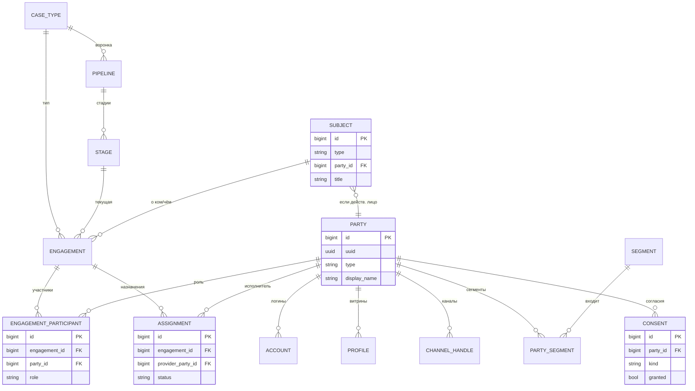
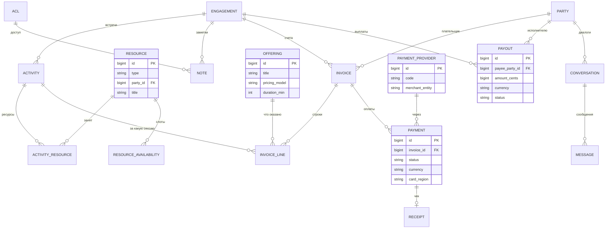

# Ядро услуг на Agdelte — стартовый документ (v6, после аудита)

> **Что изменилось от v5 (по итогам аудита).**
> Архитектура: определена модель мультитенантности и кросс-тенантный публичный скоуп (5.7);
> добавлен транзакционный **outbox** для шины событий и **webhook_inbox** для идемпотентности (5.8, 6);
> материализованы `consent` и минимальный **ACL** (цель `note.acl_ref`); деньгам добавлены
> `invoice_line.activity_id` и `currency` на `payment`/`payout`.
> Готовность к кодингу: новый **раздел 13 «Контракт headless-API»**, **раздел 14 «Ходячий скелет»**
> (порядок задач Ф0), **раздел 15 «Протокол работы с Claude Code (Opus 4.8)»** с готовым промптом
> задачи-0. Приложения: А — оценка трудозатрат, Б — функционал соцсети (Ф3).
>
> Стек зафиксирован: **Agda/Agdelte + GHC/Haskell FFI + PostgreSQL**.

---

## 0. Как этим пользоваться

1. Разделы 1–4 — рамка (4 — куда писать код). Раздел 5 — модель, типы, границы FFI, тенантность.
2. Разделы 13–15 — контракт API, порядок задач, протокол сессий с Claude Code. **Читать перед стартом.**
3. Задачи формулируем со ссылкой на сущность/событие (5–6) и конвенции (5.6, 13).

---

## 1. Что строим

**Ядро услуг** — домен-нейтральная операционка для сервисного бизнеса; вертикали садятся конфигурацией.
Поверх — сменные «головы» (соцсеть/витрина, операционная CRM, бот, виджет, B2B white-label) и
омниканальный слой. Психология — один из пакетов.

| Вертикаль | Субъект | Ключевые роли | Деньги | Комплаенс |
|---|---|---|---|---|
| Психология | клиент (человек) | client, payer | вход | высокий |
| Ветклиника | животное | владелец, payer | вход | средний |
| Медцентр | пациент (человек) | врач, кабинет/аппарат, ДМС/ОМС (орг) | вход | **высший** |
| Трансфер + переводчик | турист (человек) | driver, translator (provider), broker | вход + **выплаты** | трансгран./миграц. |
| Услуги (общее) | клиент **или объект** | исполнитель, ресурсы | вход (± выплаты) | базовый |

---

## 2. Архитектурные принципы (незыблемые)

1. **Домен-нейтральное ядро + вертикальные пакеты.** Ядро не знает слов `psych`/`vet`/`transfer`.
2. **Нейтральность на уровень выше:** agdelte не знает слова `party` (раздел 4).
3. **Headless.** Ядро = API; головы сменные; терминология живёт в голове.
4. **Object-level авторизация — в ядре/на API, не в UI** (механизм — 5.8 ACL).
5. **Правило протечек.** Зашитая единица (1 вместо N) или зашитый enum → разворачиваем.
6. **Внешние сервисы — за адаптерами.**
7. **Тон и канал — конфигурация (`сегмент` × `вертикаль`), не код.**
8. **Факты — через outbox.** Доменное событие пишется в одной транзакции с изменением данных;
   доставка at-least-once, потребители идемпотентны (раздел 6).

---

## 3. Стек и почему так

| Слой | Технология | Источник |
|---|---|---|
| Frontend | Agdelte (reactive, без Virtual DOM) | `Reactive/`, `Html/Controls/`, `Css/`, `Svg/` |
| Backend-рантайм | Agda → GHC (MAlonzo) | компиляция Agda в Haskell |
| HTTP-сервер | Warp | `FFI.Server` (`listen`), `hs/Agdelte/Http.hs` |
| Auth | JWT + bcrypt + Bearer middleware | `Auth/*`, `FFI.Crypto` |
| **БД** | **PostgreSQL** | FFI-биндинг (`postgresql-simple`); см. 5.6 |
| Платежи/выплаты | два провайдера за шлюзом | FFI к ЮKassa (РФ) и Stripe (межд./Connect) |
| JSON | `Agdelte.Json` (Decoder/Encoder, `JsonValue`) | `jsonb`-поля и тела API |

**Реконсиляция с MVP-документом «трансфер».** Функциональные требования свёрнуты сюда; стек — Agdelte.
Развилка: **(а)** трансфер на ядре; **(б)** выкидной MVP (лендинг + ручная диспетчеризация) для проверки спроса.

---

## 4. Структура и границы (куда писать код)

Четыре слоя; зависимость **только вниз**: `app → packs → services-core → agdelte`. Назад — никогда.

**Правило трёх вопросов:**
1. Нужно любому agdelte-аппу и закрывает пробел фреймворка? → **agdelte** (домен-агностично).
2. Нейтральная сервисная машинерия, переиспользуемая между вертикалями? → **services-core**.
3. Специфично для вертикали или головы? → **packs / app**.

**Два стража нейтральности** (CI-`grep`; они же — граница пакета):
- в `agdelte/` нет `party|engagement|услуг…`;
- в `services-core/` нет `psych|vet|transfer|медцентр…`.

**Что куда:**

| Слой | Что лежит |
|---|---|
| **agdelte** | Postgres-FFI + пул, HTTP-клиент, jobs/планировщик, раннер миграций, query-слой `String → IO String` |
| **services-core** | `party`/`subject`/`engagement`/`resource`/`offering` + деньги + outbox/шина событий + headless-API + ACL/authz + абстракция платёжного шлюза + омни-слой |
| **packs** | психология / вет / медцентр / трансфер |
| **app** | головы, адаптеры провайдеров и конфиг, сегменты, комплаенс-специфика, миграции |

**Выносить `services-core` в публикуемую библиотеку — не сейчас.** Огороженный модуль в одном репо;
публиковать, когда модель устаканилась и появился второй потребитель. Инфраструктуру в `agdelte` —
класть сразу (генерик и стабильна; внутренние изменения рантайма вроде tagged arrays ортогональны).

**Раскладка** (имена — черновик, подтверди):

```
repo/
  agdelte/                         # фреймворк — только домен-агностичное
    src/Agdelte/FFI/Postgres.agda  #  NEW: биндинг + пул
    hs/Agdelte/Postgres.hs
    src/Agdelte/Server/{Jobs,Webhook,Migrate,Query}.agda
  services-core/
    {Party,Subject,Engagement,Resource,Offering,Money,Events,Consent}.agda
    Api/…  Authz/…  Payments/Gateway.agda  Omni/…
  packs/
    psychology/  vet/  medical/  transfer/
  app/
    heads/{social,crm,b2b-widget}/
    config/
    migrations/
  docs/SPEC.md                     # этот документ
  CLAUDE.md                        # указатель на SPEC + протокол (раздел 15)
```

---

## 5. Модель данных

«Кейс» в SQL — `engagement`; пользователь-сотрудник — `app_user`.

### 5.1 Принципы модели (что нельзя зашивать в ядро)

| Протечка | Обобщение |
|---|---|
| Кейс привязан к одному клиенту | M:N через `engagement_participant.role` |
| Клиент — всегда человек | `party.type` = person\|org |
| Субъект = клиент | `subject` ≠ `party` (G1) |
| Один исполнитель | `resource` + ёмкость (G2) |
| Оплата = фикс за сессию | `invoice`→`payment`→`receipt`; `tax_regime` полем |
| Деньги только внутрь | `payout` + комиссия (G3) |
| Один платёжный провайдер | `payment_provider` за адаптером (раздел 7) |
| Статусы в enum | `pipeline`/`stage` как данные |
| Что оказываем — неявно | `offering` (G5) |
| Клиент = карточка = логин | `party`/`account`/`profile`/`channel_handle` |

### 5.2 ER: идентичность и кейсы

> `id` в диаграммах = `bigserial` → Agda `ℕ`; плюс `uuid`-колонка для внешних id (конвенция 5.4/5.6).



### 5.3 ER: активности, ресурсы, деньги, коммуникации



### 5.4 Базовый DDL — ID-конвенция

```sql
--   id    bigserial primary key                          -- внутр. ключ → Agda ℕ (NatMap)
--   uuid  uuid not null default gen_random_uuid() unique  -- внешний/API id → Agda String
-- FK — bigint references X(id). Чистые join-таблицы — составной PK из FK, без id/uuid.
```

Пример (остальные таблицы — по тому же шаблону):

```sql
create table party (
  id           bigserial primary key,
  uuid         uuid not null default gen_random_uuid() unique,
  type         text not null check (type in ('person','org')),
  display_name text not null,
  tz           text not null default 'Europe/Moscow',  -- IANA; рендер напоминаний
  created_at   timestamptz not null default now(),
  deleted_at   timestamptz                             -- soft-delete (см. 5.7)
);

create table engagement (
  id            bigserial primary key,
  uuid          uuid not null default gen_random_uuid() unique,
  case_type_id  bigint not null references case_type(id),
  stage_id      bigint not null references stage(id),
  owner_user_id bigint references app_user(id),
  subject_id    bigint references subject(id),
  title         text,
  created_at    timestamptz not null default now()
);
```

> Остальные таблицы (`app_user`, `account`, `profile`, `channel_handle`, `segment`, `party_segment`,
> `case_type`, `pipeline`, `stage`, `engagement_participant`, `activity`, `activity_attendee`, `note`,
> `invoice`, `invoice_line`, `payment`, `receipt`, `conversation`, `message`, `audit_log`) — по тому же
> шаблону; **состав колонок — как в v1**, в т.ч. `activity.recurrence_rule` (iCal RRULE),
> `activity.status`, `payment.provider_ref`, `note.sensitivity`, `invoice.currency`. Первую миграцию
> генерит Claude Code по этой конвенции.
>
> **Индексы первой миграции:** все FK; `unique(channel_handle.channel, address)`;
> `activity(starts_at)`; `unique(payment.provider_ref) where provider_ref is not null` (идемпотентность);
> `outbox_event(processed_at) where processed_at is null`.

### 5.5 Дельта-DDL: обобщения + платежи

```sql
-- == G1: Субъект ==
create table subject (
  id        bigserial primary key,
  uuid      uuid not null default gen_random_uuid() unique,
  type      text not null check (type in ('person','org','animal','object')),
  party_id  bigint references party(id),
  title     text not null,
  attrs     jsonb not null default '{}'
);

-- == G2: Ресурсы и ёмкость ==
create table resource (
  id        bigserial primary key,
  uuid      uuid not null default gen_random_uuid() unique,
  type      text not null check (type in ('staff','room','vehicle','device')),
  party_id  bigint references party(id),
  title     text not null,
  attrs     jsonb not null default '{}'
);
create table resource_availability (
  id          bigserial primary key,
  resource_id bigint not null references resource(id) on delete cascade,
  starts_at   timestamptz not null,
  ends_at     timestamptz not null,
  kind        text not null default 'free'
);
create table activity_resource (
  activity_id bigint not null references activity(id) on delete cascade,
  resource_id bigint not null references resource(id),
  primary key (activity_id, resource_id)
);

-- == G5: Каталог услуг ==
create table offering (
  id               bigserial primary key,
  uuid             uuid not null default gen_random_uuid() unique,
  case_type_id     bigint references case_type(id),
  title            text not null,
  duration_min     int,
  pricing_model    text not null check (pricing_model in ('fixed','per_minute','per_hour','package','dynamic')),
  base_price_cents bigint,
  attrs            jsonb not null default '{}'
);
create table offering_resource_req (
  id            bigserial primary key,
  offering_id   bigint not null references offering(id) on delete cascade,
  resource_type text not null,
  qty           int not null default 1
);
alter table invoice_line add column offering_id bigint references offering(id);

-- == G4: Матчинг / журнал назначений ==
create table assignment (
  id                bigserial primary key,
  uuid              uuid not null default gen_random_uuid() unique,
  engagement_id     bigint not null references engagement(id) on delete cascade,
  provider_party_id bigint not null references party(id),
  resource_id       bigint references resource(id),
  role              text not null default 'provider',
  status            text not null default 'offered'
                    check (status in ('offered','accepted','declined','replaced'))
);

-- == G3: Выплаты + комиссия + эскроу ==
create table payout (
  id             bigserial primary key,
  uuid           uuid not null default gen_random_uuid() unique,
  engagement_id  bigint references engagement(id),
  payee_party_id bigint not null references party(id),
  amount_cents   bigint not null,
  currency       text not null default 'RUB',
  method         text not null,
  status         text not null default 'scheduled'
                 check (status in ('scheduled','sent','failed')),
  scheduled_at   timestamptz,
  sent_at        timestamptz
);
alter table payment add column platform_fee_cents bigint not null default 0;
alter table invoice add column terms  text;        -- 'prepaid' | 'net7' | 'net30'
alter table invoice add column due_at timestamptz;

-- == Платёжные провайдеры ==
create table payment_provider (
  id              bigserial primary key,
  uuid            uuid not null default gen_random_uuid() unique,
  code            text not null,             -- 'yookassa' | 'stripe'
  merchant_entity text not null,
  capabilities    jsonb not null default '{}',
  enabled         boolean not null default true
);
alter table payment add column provider_id  bigint references payment_provider(id);
alter table payment add column card_region  text;  -- 'ru' | 'intl'
-- payment.status расширить: pending -> held -> captured -> refunded (пересоздать CHECK).
```

### 5.6 Маппинг типов SQL↔Agda и границы FFI

Привязано к исходникам agdelte (`FFI.Shared`, `FFI.Server`, `FFI.Time`, `Json`, `Storage.AppStore`).
На границе FFI **всё — `String`**; идентификаторы/деньги/время — `ℕ` (BigInt-backed).

| PostgreSQL | Haskell (postgresql-simple) | Agda (agdelte) | Примечание |
|---|---|---|---|
| `bigserial` (внутр. PK) | `Int64`/`Integer` | `ℕ` | ID везде `ℕ` (NatMap, `UserId=ℕ`) |
| `uuid` (внешний id) | `UUID`/`Text` | `String` | для API; не внутренний ключ |
| `text`, `varchar` | `Text` | `String` | граница FFI — `T.Text`↔`String` |
| `bigint` (деньги, копейки) | `Integer` | `ℕ` | минорные единицы |
| `integer`, `smallint` | `Int` | `ℕ` / `ℤ` (если <0) | `ℤ` тоже BigInt-backed |
| `boolean` | `Bool` | `Bool` | Serialize: `"true"`/`"false"` |
| `timestamptz` | `UTCTime`/POSIX | `ℕ` (unix-сек) | в PG — timestamptz, через FFI — секунды |
| `jsonb` | `Aeson.Value`/`Text` | `Agdelte.Json.JsonValue` или `String` | в JSON нет BigInt — большие числа строкой |
| `text`+CHECK / enum | `Text` | замкнутый `data` + ↔`String` | паттерн `parseSubStatus` (через `≟`) |
| `text[]` | `[Text]` | `List String` | length-prefixed; либо вынести в таблицу |
| `bytea` | `ByteString` | `String` (base64) | `base64Encode` |
| `double precision` (GPS) | `Double` | `Float` | для денег НЕ использовать |
| `NULL` | `Maybe a` | `Maybe A` | `"just:"`/`"nothing"` |

**Три границы FFI:**
1. **Строки не пересекают FFI как кортежи** (Σ/`_×_` не идёт в `COMPILE GHC`; ср. `StrPair`).
   Запросный API — `String → IO String`: Haskell `FromRow` → сериализация строки (pipe как в
   `AppStore` либо JSON) → Agda декодит `Serialize`/`Agdelte.Json`. Маршалинг ручной.
2. **Соединение/пул — непрозрачный handle.** `postulate Conn : Set` → `Connection`/пул в
   `IORef`/`MVar` (оба в `FFI.Server`). **Task-0 спайк** (раздел 14).
3. **ID — `ℕ`-суррогаты, uuid отдельной колонкой.**

### 5.7 Мультитенантность и публичный скоуп

- **Тенант = операционная организация** (соло-психолог, клиника, центр трансфера). Все
  *операционные* таблицы несут `tenant_id bigint not null` + Postgres **RLS** по нему.
- **Глобальные справочники** (`payment_provider`, общие таксономии `segment`) — `tenant_id null`
  = глобальная запись.
- **Публичный кросс-тенантный скоуп** (иначе Ф3-витрина сломается об RLS): `profile(kind='public', is_public)`,
  `review`, каталожные представления. Читаются отдельной ролью с политикой «read для `is_public`»;
  пишутся только своим тенантом. Отзыв — артефакт публичного скоупа, рождающийся из факта оплаты.
- **Удаление/ретенция:** операционные таблицы получают `deleted_at` (soft-delete); право на удаление
  по 152-ФЗ для `party` = процедура анонимизации (display_name, контакты, handles), а не физический
  delete — финансовые записи (54-ФЗ) обязаны жить дольше.

### 5.8 Дельта аудита: outbox, inbox, согласия, ACL, связки денег

```sql
-- Транзакционный outbox: событие пишется в ОДНОЙ транзакции с изменением данных
create table outbox_event (
  id           bigserial primary key,
  uuid         uuid not null default gen_random_uuid() unique,
  topic        text not null,              -- имя из раздела 6
  payload      jsonb not null,             -- min: tenant uuid, entity uuid, ts, actor
  created_at   timestamptz not null default now(),
  processed_at timestamptz                 -- null = не доставлено
);

-- Входящие вебхуки: идемпотентность приёма
create table webhook_inbox (
  id           bigserial primary key,
  provider     text not null,              -- 'yookassa'|'stripe'|'edna'
  external_id  text not null,              -- id события у провайдера
  payload      jsonb not null,
  received_at  timestamptz not null default now(),
  processed_at timestamptz,
  unique (provider, external_id)
);

-- Согласия (152-ФЗ; событие party.consent_updated)
create table consent (
  id         bigserial primary key,
  party_id   bigint not null references party(id),
  kind       text not null,                -- 'pd_processing'|'channel_wa'|'clinical_work'|...
  granted    boolean not null,
  granted_at timestamptz not null default now(),
  source     text
);

-- Минимальный ACL (цель note.acl_ref; team добавится позже)
create table acl (
  id bigserial primary key
);
create table acl_entry (
  id          bigserial primary key,
  acl_id      bigint not null references acl(id) on delete cascade,
  app_user_id bigint not null references app_user(id),
  permission  text not null check (permission in ('read','write'))
);
-- note.acl_ref => bigint references acl(id)

-- Связки денег
alter table invoice_line add column activity_id bigint references activity(id);
  -- «за какую сессию/пропуск выставлено»: оплата сессии, late-cancellation
alter table payment add column currency text not null default 'RUB';
  -- счёт и его платежи — в одной валюте; ядро валюты НЕ конвертирует (FX вне ядра)
```

> Баланс пакетов (`package.balance_low`) — модель уровня Ф1: пакет = `offering(pricing_model='package')`
> + таблица баланса в пакете/Ф1, не в ядре. `review` — таблица Ф3 (Приложение Б).

---

## 6. Каталог доменных событий и доставка

**Кейсы/расписание:** `engagement.created/stage_changed/closed`,
`activity.scheduled/rescheduled/canceled/reminder_due/completed/no_show`.
**Назначения:** `assignment.offered/accepted/declined/replaced`.
**Поездка (трансфер):** `trip.started`, `trip.completed`.
**Деньги:** `invoice.issued/due`, `payment.link_created/held/captured/succeeded/failed/refunded`,
`receipt.issued`, `payout.scheduled/sent`, `package.balance_low`, `subscription.charge_upcoming`.
**Идентичность/коммуникации:** `party.channel_linked`, `party.consent_updated`, `party.verified`,
`message.inbound_received`.
**Соцсеть/витрина:** `profile.review_eligible`, `review.submitted`.

**Доставка (outbox-семантика):** producer пишет в `outbox_event` в той же транзакции, что и данные;
диспетчер (job) опрашивает `processed_at is null`, доставляет потребителям (омни-слой, аналитика,
головы), помечает. Гарантия — **at-least-once**, поэтому каждый потребитель идемпотентен (по
`outbox_event.uuid`). Вебхуки провайдеров входят через `webhook_inbox` (unique по
`provider, external_id`) и нормализуются в те же топики.

---

## 7. Платежи, выплаты, фискализация

Провайдеры за единым шлюзом; ядро денег провайдер-агностично.

### 7.1 Абстракция шлюза
Интерфейс: `create · hold/capture · refund · split · payout · webhook-normalize`. ЮKassa и Stripe —
адаптеры. Идемпотентность — `payment.provider_ref` (unique) + `webhook_inbox`.

### 7.2 Маршрутизация
| Сценарий | Провайдер | Почему |
|---|---|---|
| RU-карта (МИР, российская Visa/MC) | ЮKassa | РФ-эквайринг, фискализация 54-ФЗ |
| Иностранная карта / межд. Apple-Google Pay | Stripe | международный эквайринг |
| Выплата резиденту РФ | ЮKassa / RU-рельсы | внутренняя |
| Выплата нерезиденту | Stripe Connect / Payoneer / SWIFT | трансграничная |
| Эскроу/сплит | ЮKassa «безопасная сделка» / Stripe Connect | своими примитивами |

Выбор — по BIN или явной кнопкой → `payment.card_region` + `payment.provider_id`.

### 7.3 Сценарии денег
Сессия/пакет/подписка; эскроу `held → captured`; сплит `platform_fee_cents` + `payout`;
B2B-постоплата `invoice.terms='net30'`; динамика `pricing_model='dynamic'`; чеки `receipt.tax_regime`;
привязка к сессии — `invoice_line.activity_id`.

### 7.4 Жёсткие ограничения (структура, не код)
- **Две принимающие сущности** (РФ под ЮKassa, зарубежная под Stripe).
- **Карты не ходят крест-накрест** (проверка по BIN).
- **Фискализация 54-ФЗ — только на ЮKassa.**
- **Маркетплейс-примитивы не идентичны** → общий знаменатель в интерфейсе шлюза.
- **Ядро не делает FX**; валюта фиксируется на счёте и его платежах.

---

## 8. Омниканальность

**edna** как омни-провайдер; резолв `channel_handle → party`; `conversation` к `party`/`engagement`;
без `consent` соответствующего `kind` омни-слой не шлёт. RTL/арабский — i18n головы; AI-перевод — в
омни-слое по конфигу сегмента; B2B white-label — голова. Тон/канал = `f(сегмент, вертикаль)`.

---

## 9. Вертикальные пакеты

- **9.1 Психология.** Клинические заметки (`sensitivity='clinical'` + ACL), модальность, согласия.
- **9.2 Ветклиника.** Субъект = животное; владелец/плательщик — роли.
- **9.3 Медцентр.** Субъект = пациент; ресурсы врач+кабинет+аппарат; ДМС/ОМС; высшая чувствительность.
- **9.4 Услуги (общее).** Бронирование оффера, исполнитель, ресурсы, оплата, отзывы.

### 9.5 Трансфер + переводчик (ArabRide / Taraeeq)
Двусторонний рынок; заказ бандлит водителя+авто и переводчика (две `assignment`).
Авто — `resource type='vehicle'`; переводчик — `party`+`profile` (языки, диалект, пол).
Тарифы — `offering`. Диспетчеризация: ручная → авто-матчинг; автозамена при отказе.
Жизненный цикл: новая→назначен→в пути→завершён/отменён; GPS — контекст `trip_tracking`, не ядро.
Деньги: холд→сплит→выплаты нерезидентам; B2B-постоплата; surge. KYC → `party.verified`.
B2B white-label; RTL+AI-перевод; отзывы→матчинг; страхование (ответственность перевозчика,
невыезд переводчика) — доменное расширение пакета.

---

## 10. Безопасность и комплаенс

От высшей: **медцентр** → **психология** (152-ФЗ спец-категория) → **трансфер** (валютный контроль,
AML/115-ФЗ, миграционные данные, KYC) → **ветклиника** (PII владельца) → **услуги**. Плюс платёжный
комплаенс (7.4), согласия (`consent`), аудит (`audit_log`), анонимизация вместо удаления (5.7).
Слабо ускоряется Claude Code — закладывать время.

---

## 11. Дорожная карта

**Ф0** фундамент (порядок — раздел 14) → **Ф1** MVP одной вертикали (ЮKassa) → **Ф2** вторая
вертикаль + Stripe (при наличии сущности) → **Ф3** витрина/соцсеть (+SSR; Приложение Б) →
**Ф4** омни-слой + матчинг.

---

## 12. Открытые решения и риски

- **Зарубежное юрлицо под Stripe?** Деградация без него: только ЮKassa; Stripe — строкой в
  `payment_provider`.
- **SSR/SEO для витрины** (+RTL/i18n для трансфера).
- **GPS-трекинг** — отдельный bounded context, возможно вне Agda.
- **Стек трансфер-MVP** — ядро vs выкидной лендинг.
- **Главный технический неизвестный:** Postgres-пул через FFI/Warp — снять спайком (задача 0, раздел 14).
- **Команды сборки/dev-loop** — TODO подтвердить: как собирается серверный таргет agdelte
  (`agda --compile`? Makefile? скрипт) и как гоняются тесты. До подтверждения Claude Code работает
  по образцу существующей сборки репозитория agdelte.
- **Налог на дозревание agdelte**; **редкий навык Agda+Haskell**.

---

## 13. Контракт headless-API

- **Маршруты:** `/api/v1/<entity>` (мн. число kebab-case): `GET /api/v1/engagements`,
  `POST /api/v1/engagements`, `GET/PATCH/DELETE /api/v1/engagements/{uuid}`.
  Действия-команды: `POST /api/v1/engagements/{uuid}/stage` и т.п.
- **Наружу — только `uuid`.** `bigint id` никогда не покидает сервер.
- **Конверт:** успех `{"data": …}` (объект или массив), ошибка
  `{"error": {"code": "...", "message": "..."}}`. Коды: `not_found`, `validation`, `forbidden`,
  `unauthorized`, `conflict`, `internal`.
- **Auth:** `Authorization: Bearer <jwt>` (agdelte `Auth/*`); object-level проверка (ACL/владение) —
  до выполнения, в ядре.
- **Пагинация:** `?limit=&cursor=` (cursor = uuid последней записи); ответ несёт `next_cursor`.
- **Тенант** выводится из JWT, не из URL/тела.
- **Время** в API — unix-секунды (числом), как на границе FFI; деньги — minor units + `currency`.

---

## 14. Ходячий скелет: порядок задач Ф0

Тонкий сквозной срез до ширины. Каждая задача — отдельная сессия Claude Code, завершённая тайпчеком.

1. **Задача 0 (спайк, снимает главный риск):** `FFI/Postgres.agda` + `hs/Agdelte/Postgres.hs`:
   `Conn`-пул в `MVar`, `query : String → IO String`, один roundtrip (`select 1` → insert/select
   на временной таблице) под Warp. Цель — доказать, что пул живёт между запросами.
2. Раскладка каталогов (раздел 4) + два CI-`grep`-стража + раннер миграций.
3. Полная схема: миграции по 5.4 (v1-таблицы) + 5.5 + 5.8 + `tenant_id`/RLS (5.7) + индексы.
4. **Вертикальный срез `party`:** Agda-тип + Serialize/Json кодеки + CRUD-эндпойнты по контракту 13 +
   тест roundtrip. Это эталон для генерации остальных сущностей.
5. `engagement` + `participant` + `case_type/pipeline/stage` (конфиг стадий — данными).
6. `activity` + jobs-планировщик: `reminder_due` в `outbox_event`; диспетчер outbox.
7. Деньги: `invoice/payment` + скелет шлюза + адаптер ЮKassa (ссылка на оплату) +
   `webhook_inbox` → нормализация → `payment.succeeded` → смена статусов.
8. Минимальная голова: список engagements + карточка (DataGrid из `Html/Controls/`), биндинг к API.

После п.8 есть ходячий продукт-скелет; дальше — ширина (note+ACL, consent, остальные сущности) и Ф1.

## 15. Протокол работы с Claude Code (Opus 4.8)

**Подготовка репо:**
- Этот файл → `docs/SPEC.md`. В корень — `CLAUDE.md`: «прочитай docs/SPEC.md; разделы 4 (слои),
  5.6 (типы/FFI), 13 (API), 14 (текущая задача); соблюдай grep-стражей».
- agdelte подключить субмодулем/каталогом — его `CLAUDE.md` и `doc/api/*` должны быть видимы.

**Правила сессии:**
1. **Одна задача из раздела 14 за сессию.** Не «сделай всё».
2. **Перед кодом на Agda** — прочитать образцы: `src/Agdelte/FFI/{Shared,Server}.agda`,
   `hs/Agdelte/{Http,Crypto}.hs`, `src/Agdelte/Storage/AppStore.agda` (сериализация),
   `src/Agdelte/Json.agda`. **Идиомы не изобретать — копировать из исходников** (обучающих данных
   по agdelte у модели нет).
3. После каждого шага — **тайпчек**; в конце — grep-стражи (раздел 4).
4. Что идёт под ревью человека (не мерджить автономно): дизайн FFI-границы, authz/ACL, аудит,
   эскроу/сплит/выплаты, маршрутизация провайдеров, доказательства/оптики.
5. Генерировать смело: FFI-постулаты + Haskell-обвязку, `FromRow`+wire-сериализацию, CRUD по
   эталону задачи 4, миграции, обработчики вебхуков.

**Готовый промпт задачи 0 (вставить в Claude Code):**

> Прочитай docs/SPEC.md (разделы 4, 5.6, 14 — задача 0). Изучи в agdelte: src/Agdelte/FFI/Shared.agda,
> src/Agdelte/FFI/Server.agda, hs/Agdelte/Http.hs, hs/Agdelte/Crypto.hs — это образцы FFI-стиля.
> Сделай агдовский биндинг к PostgreSQL по этому стилю: postulate Conn, пул соединений в MVar на
> Haskell-стороне (postgresql-simple), функция query : String → IO String (вход — SQL+параметры в
> согласованном wire-формате, выход — строки результата, сериализованные как в Storage/AppStore.agda).
> Подними минимальный Warp-эндпойнт, который на каждый запрос делает select из временной таблицы.
> Критерий: пул переживает множественные запросы; тайпчек проходит; grep-стражи из SPEC раздела 4 чисты.
> Ничего доменного (party и т.п.) в agdelte/ не добавлять.

**Конвенции** (дублируют разделы 4/5/13 — для быстрых ссылок): слои и grep-стражи; запросный API
`String → IO String`; `id bigserial`(→`ℕ`) + `uuid`; типы по 5.6; БД `snake_case`, ед. число;
`case→engagement`, `user→app_user`; `tenant_id`+RLS; наружу только uuid.

---

## Чеклист старта (Фаза 0)

- [ ] `docs/SPEC.md` + `CLAUDE.md` по разделу 15; agdelte как субмодуль
- [ ] Задача 0: Postgres-спайк (раздел 14, п.1)
- [ ] Каталоги + CI-grep-стражи + раннер миграций (п.2)
- [ ] Полная схема + RLS + индексы (п.3)
- [ ] Эталонный срез `party` (п.4) → далее по порядку 14
- [ ] Решения из раздела 12: WAL/AppStore; юрлицо под Stripe; трансфер на ядре или выкидной MVP;
      команды сборки/dev-loop

---

## Приложение А. Оценка трудозатрат

Допущения: один senior Agda+Haskell, Claude Code в контуре, цифры учитывают трение стека.
Без Claude Code итог был бы ~в 1,4–1,7× выше; сильнее всего ускоряются FFI-биндинги/CRUD/склейка,
слабее — доказательства, идиомы agdelte, комплаенс, интеграции.

| Поток работ | MVP (одна вертикаль), ч | Полная версия, ч |
|---|---|---|
| Серверная часть + дозревание agdelte | 80–160 | 200–380 |
| Доменное ядро (модель, headless-API, события, authz/аудит) | 90–170 | 180–320 |
| Платежи + фискализация | 50–100 | 90–170 |
| Расписание + напоминания | 50–110 | 60–120 |
| Омниканальный слой | в строке выше | 110–200 |
| Вертикальные пакеты | 60–120 | 140–240 |
| UI продуктов (головы) | 110–200 | 320–560 |
| Кросс-каттинг (RBAC, безопасность, тесты, CI/CD) | 70–140 | 160–300 |
| **Итого** | **~500–1000** | **~1300–2300** |

≈150 продуктивных ч/мес: MVP ≈ 3,5–6,5 мес; полная ≈ 9–15 мес одного человека. Главные свинги:
SSR витрины (+80–200 ч), трансграничные выплаты/комплаенс, скорость въезда в идиомы agdelte.

## Приложение Б. Соцсеть/витрина — функционал Ф3 (краткая спека)

Два контура: **витрина для клиентов** (верх воронки) и **проф-сообщество** (удержание специалистов).
Ядро Ф3 — витрина:
- **Публичный профиль** специалиста: образование, подход/специализация, формат, цена
  (`profile kind='public'`, публичный скоуп 5.7).
- **Каталог и поиск** с фильтрами (проблема/подход/цена/город/онлайн) — на `segment`-таксономиях.
- **Контент**: статьи, «вопрос-ответ» (SEO-трафик) — требует решения по SSR (раздел 12).
- **Верифицированные отзывы**: `review` создаётся только при факте оплаченной активности
  (`profile.review_eligible` из событий денег); рейтинг влияет на матчинг.
- **Верификация дипломов/документов** — модерация, `party.verified`.
- Проф-сообщество (кейсы, супервизия, группы, реферралы) — после витрины.
Мост: витрина → оплата → первая запись в CRM → отзыв обратно в витрину.

DDL Ф3 (эскиз): `review(id, uuid, author_party_id, target_party_id, engagement_id, rating, body,
is_public, created_at)` — в публичном скоупе; полную модель писать при входе в Ф3.
